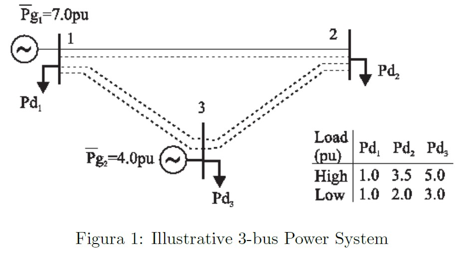

#%% md

# Optimization of a power system
Student: Bruno Kiyoshi Ynumaru; Prof. Eduardo Camponogara

#%% md

In this exercise, you will have the opportunity to approximate a nonlinear problem
as a MILP by means of piecewise-linear models. The power system has 3 buses
as depicted in Fig. 1. Buses 1 and 3 have generation units, whereas bus 2 is a
power consumer. This Figures also gives the maximum power generation ($\bar{P_{gi}}$) and
the power consumption ($\bar{P_{di}}$) of each bus i, under low and high demand. The
properties of the transmission lines appear in Table 1, in pu using a 100 MVA basis,
are indicated in the Figure. The parameters are the resistance $r_{i,j}$ , the reactance $x_{i,j}$
and the number of lines installed between buses i and j.

#%% md

#%% md

|Line| $r_{i,j}$ (pu)| $x_{i,j}$ (pu)| ni,j|
|----|---------------|---------------|----------|
|1-2 | 0.030         |0.23           |2         |
|1-3 |0.035          | 0.25          |1         |
|2-3 | 0.025         | 0.20          |1         |

#%% md

A simplified model is adopted for the transmission network, in which:  
•Lines and transformers are represented by their series impedances in per unit:  

$z_{i,j} = r_{i,j} + jx_{i,j} \space \space (1)$

where ri;j is the resistance and xi;j is the reactance of line (i; j).  
• Voltage magnitudes are fixed at 1:0 pu.  
• Reactive power balance is supposed to be satisfied.  
With these assumptions, active power flows are expressed as  
\begin{equation}
$p.flow \space i \rightarrow j : P_{i,j} = g_{i,j}-(g_{i,j} cos\theta_{i,j} + b_{i,j} sin \theta_{i,j}) \space (2a)\\ $
p.flow \space j \rightarrow i : P_{j,i} = g_{i,j}-(g_{i,j} cos\theta_{i,j} - b_{i,j} sin \theta_{i,j}) \space (2b) 
\end{equation}  
where $gij$ and $b_{ij}$ are, respectively, the series conductance and series susceptance of
line (i, j), $\theta_{i,j} = (\theta_i - \theta_j)$ and $\theta_i$ is the voltage angle of bus i.  
Conductance and susceptance are calculated as follows  
\begin{equation}
g_{i,j}=\frac{r_{i,j}}{(r^2_{i,j}+x^2_{i,j})}\\
b_{i,j}=-\frac{x_{i,j}}{(r^2_{i,j}+x^2_{i,j})}
\end{equation}  
The power injected into bus i is defined as  
\begin{equation}
P_i=\sum_{j \in N_i} n_{i,j}P_{i,j} = \sum_{j \in N_i}n_{i,j}[g_{i,j}-(g_{i,j}cos\theta_{i,j}+b_{i,j}sin\theta_{i,j}])] \space (3)
\end{equation}  
where $N_i$ is the set of neighboring buses of bus i. To ensure energy conservation, the
following equations must also be satisfied  
\begin{equation}
Pg_i=\bar{Pd_i}+P_i \space (4)
\end{equation}  
Aiming to minimize the power loss in transmission, the power-flow optimization problem could be solved:  

\begin{equation}
min \sum_{i \in N} |P_i| \\
s.t: Pg_i=\bar{Pd_i}+P_i, \\
P_i=\sum_{j \in N_i} n_{i,j}P_{i,j}, \\
0 \le Pg_i \le \bar{Pg_i}, \\
\theta_i \in [\frac{-\pi}{2},\frac{\pi}{2}, i \in N],  \\
P_{i,j} = g_{i,j}-(g_{i,j} cos\theta_{i,j} + b_{i,j} sin \theta_{i,j}),\\
\theta_{i,j}=\theta_i-\theta_j, \\
\theta_{i,j} \in [-\pi,\pi], i \in N, j \in N_i
\end{equation}

Tasks:  
• Reformulate the power-flow optimization problem in MILP using the following piecewise-linear models: CC and SOS2.  
• Implement the models in AMPL, choosing a suitable number of breakpoints to induce a good approximation of the power-flow equations. You may plot the piecewise linear approximations for sin $\theta_{i,j}$ and cos $\theta_{i,j}$ in order to show the degree of approximation.  
• Solve the problem for the low and high power demand cases. Present and illustrate the solutions.  
